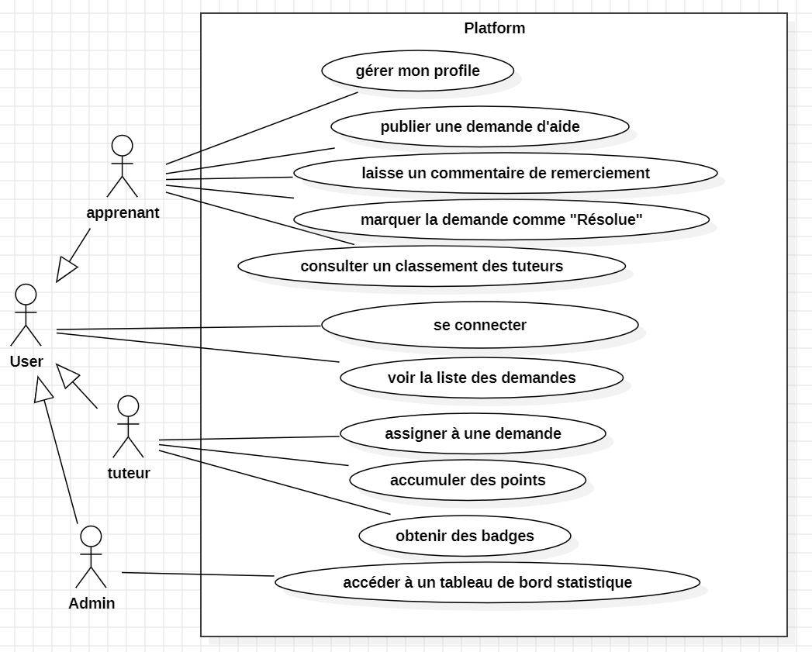
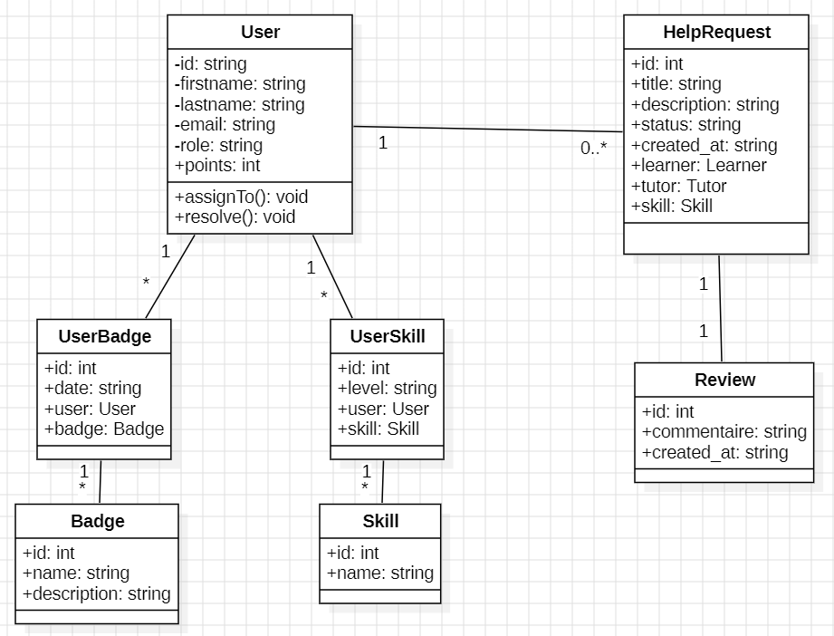
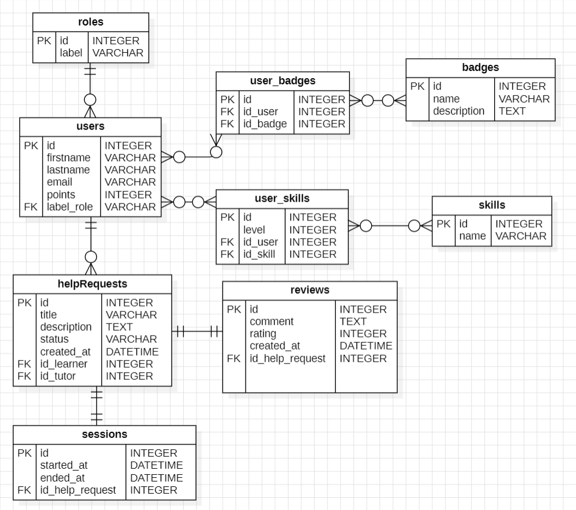

# 🚀 PeerSync

PeerSync est une plateforme interne développée pour l’ENAA permettant de faciliter l’entraide entre apprenants. Elle permet de centraliser les demandes d’aide, d’améliorer leur visibilité et de valoriser les tuteurs.

## 🎯 Objectifs du projet

- Centraliser les demandes d’aide (éviter la perte sur Discord)
- Mettre en relation apprenants et tuteurs
- Suivre les sessions d’entraide
- Implémenter un système de notation et de gamification
- Fournir des statistiques à l’administration
## 🧩 Fonctionnalités principales

- 👤 Gestion des utilisateurs Authentification
Rôles : Apprenant / Tuteur / Admin
Gestion des compétences
- 🎫 Gestion des demandes d’aide
Création de tickets
Attribution à un tuteur
Suivi du statut (PENDING, ASSIGNED, RESOLVED)
- ⭐ Système d’évaluation
Notation des tuteurs (1 à 5)
Commentaires
- 🏆 Gamification
Attribution de points
Système de badges
Leaderboard
- 📊 Dashboard Admin
Statistiques globales
Top tuteurs
Technologies les plus demandées
## 🏗️ Architecture du projet

Le projet suit une architecture orientée objet avec séparation des responsabilités :

- Entities/ : Contient les classes métier (User, HelpRequest, Review, etc.)
- Repositories/ : Gestion de l’accès aux données (PDO, requêtes SQL)
- Database/ : Connexion à la base de données
- Services/ (optionnel) : Logique métier
## 🗃️ Base de données

Tables principales :

- users
- roles
- help_requests
- reviews
- sessions
- skills
- badges

Tables de liaison :

- user_skills
- user_badges
## 🛠️ Technologies utilisées
- PHP (procédural)

- MySQL (base de données)

- HTML5 / CSS3

- Tailwind CSS (via CDN)

- XAMPP / WAMP (environnement local)
## 📊 Diagrammes UML

# diagramme de cas d'utilisation

# diagramme de classe

# diagramme ERD

## 🧩 Technologies Utilisées
## Backend

* PHP 8
* POO
* PDO
* MySQL

---

## Frontend

* HTML5
* TailwindCSS
* JavaScript

---

## Architecture

* MVC simplifié
* Repository Pattern
* Service Layer
* Encapsulation

---
